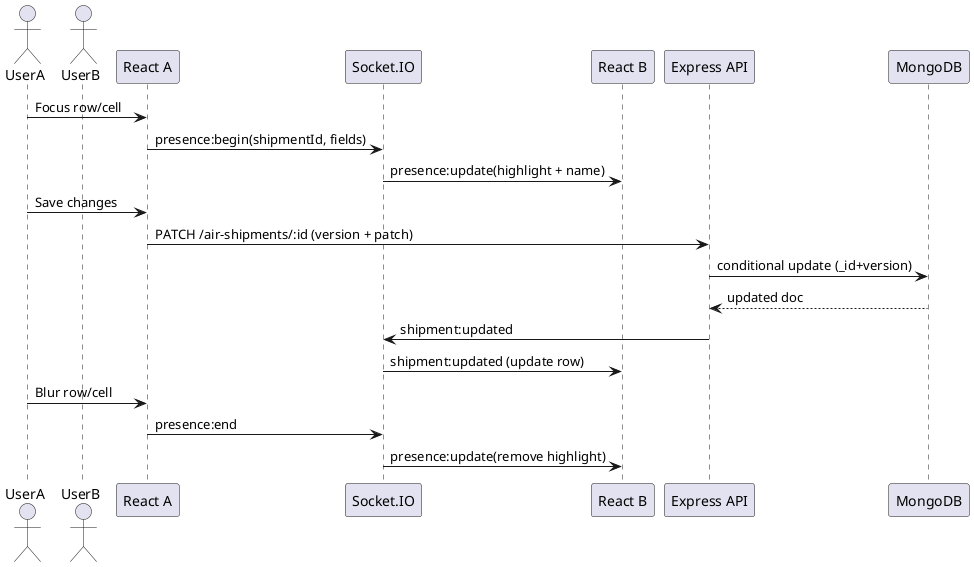

# SPEC-1-Information Tracker System

## Background

**Purpose.** Build a small, production-like prototype of an internal Information Tracker to demonstrate full‑stack skills during interviews and to support the current company with a simple CRUD workflow.

**Context.** Single-tenant internal web app; private login only (no self sign-up). Minimal but clean UX to manage records, with role-based permissions and the ability to export tabular data to Excel.

**Tech Constraints (agreed).**
- Frontend: React + Zustand for state management (later suggest a simple static hosting option for deployment).
- Backend: Node.js + Express.
- Database: MongoDB.
- Deployment: Render for backend (per note). Frontend deployment to be suggested later.
- Auth: Simple username/password login; users provisioned by an admin (seeded), not self-registered.

**Non-Goals (for MVP).**
- No OAuth/SAML/SSO, MFA, or password reset flows (unless later requested).
- No real-time collaboration; basic request/response is sufficient.
- No advanced auditing beyond who/when created/updated/deleted (soft delete optional).

**Success Criteria.**
- A runnable demo with seeded users and roles, CRUD on a clearly defined primary entity, role-guarded routes/APIs, and working Export-to-Excel. Backend deployed to Render; frontend deploy target chosen and documented. Clear README + scripts so a contractor could reproduce the setup quickly.

## Requirements

### Domain
- **Primary Data Model (collection): `air_shipments`** — “AIR SHIPMENTS”.

### Roles
- **Admin**
- **TL** (Team Lead)
- **Analyst**
- **Billing**

### MoSCoW
**Must Have**
- Login (no self sign-up). Seeded users with roles: Admin, TL, Analyst, Billing.
- Role-Based Access Control (RBAC) with *field-level* access groups (see below).
- CRUD for `air_shipments` with constraints:
  - **Create**: Admin, TL, Analyst can create; **Billing cannot create**.
  - **Read**: All roles can view (subject to field access groups).
  - **Update**: All roles can edit (subject to field access groups).
  - **Delete**: Only **Admin** and **TL**.
- Export current table view to **Excel (.xlsx)**.

**Should Have**
- Soft delete with restore (keeps audit trail).
- Basic activity logging (who/when created/updated/deleted) and an **Activity Logs** field visible to TL/Admin.
- Pagination, search, and sort on key fields.

**Could Have**
- CSV/XLSX import.
- Column-level filters and saved views per role.

**Won’t Have (MVP)**
- Self-service user management, password reset, or SSO.
- Real-time updates.

### Field Access Groups
To keep rules manageable, fields are grouped; visibility/edit rights apply per group.

**Group A — Core Shipment Fields** *(visible/editable by Admin, TL, Analyst, Billing)*
- `client` (TEXT)
- `flightNumber` (TEXT)
- `flightStatus` (TEXT)
- `etaEst` (DATE)
- `etaStatus` (TEXT)
- `preAlertDate` (DATE)
- `etaDate` (DATE)
- `releaseDate` (DATE)
- `releaseStatus` (TEXT)
- `port` (TEXT)
- `nameAddress` (BOOL)  
  *Update: per user note, this is a boolean flag*  
- `lateSecured` (BOOL)
- `goodsDescription` (BOOL)
- `changeMAWB` (BOOL)
- `changeCounts` (BOOL)
- `mismatchValues` (BOOL)
- `awb` (TEXT)
- `clvs` (INT)
- `lvs` (INT)
- `pga` (INT)
- `total` (INT)
- `totalFoodItems` (INT)
- `analyst` (TEXT)
- `shipmentComments` (TEXT)

**Group B — Billing Fields** *(visible/editable by Admin, TL, Billing; hidden from Analyst unless specified otherwise)*
- `cadTransactionNumber` (TEXT)
- `cadTransNumStatus` (TEXT)
- `dutiesLvs` (FLOAT)
- `taxesLvs` (FLOAT)
- `dutiesPga` (FLOAT)
- `taxesPga` (FLOAT)
- `invoiceNumber` (TEXT)
- `billingDate` (DATE)
- `billingClerk` (TEXT)
- `droppedToSftp` (BOOL)
- `billingComments` (TEXT)

**Group C — Activity Logs** *(visible/editable by Admin, TL)*
- `activityLogs` (TEXT)

### Real-Time Collaboration (Lightweight)
- **Presence & Edit Highlighting (Must Have):** When a user is editing a row/field, other users see a highlight/outline with the editor’s display name (Excel-like). This is *presence signaling*, not full collaborative editing.
- **Concurrency Policy:** Default is **optimistic concurrency** (no hard locks). Conflicts detected server-side by a version field; client shows a toast to reload/merge.

### Bulk Editing
- **Multi-row operations (Must Have):** Select multiple rows to apply one or more changes in a single commit ("multiple queries"), e.g. set `releaseStatus` and `etaStatus` for 10 rows.
- **Who can bulk edit (Must Have):**
  - **Admin, TL:** can bulk edit any fields they’re allowed to edit.
  - **Billing:** can bulk edit **Group B only**.
  - **Analyst:** **no bulk edit**.

| Role    | Create | Read | Update | Delete | Export to Excel |
|---------|:------:|:----:|:------:|:------:|:---------------:|
| Admin   |  Yes    | Yes  | Yes     | Yes    | Yes             |
| TL      |  Yes    | Yes  | Yes     | Yes    | Yes             |
| Analyst |  Yes    | Yes  | Yes (Group A only) | No | Yes            |
| Billing |  No     | Yes  | Yes (Group A & B)  | No | Yes            |

> **Note:** Read/Update are constrained by field groups above.

### Non-Functional Requirements
- Simple, secure auth (hashed pwd), server-side RBAC enforcement, and client-side guards.
- Data validation at API boundary; clean error messages.
- Dates stored as ISO-8601; numeric fields validated; booleans strict.
- Basic audit fields: `createdBy`, `createdAt`, `updatedBy`, `updatedAt`, `deletedAt`, `deletedBy`.
- MVP responsive layout; target < 1.5s P95 for list queries at 1k records.
- **Real-time channel** for presence highlights with sub-1s latency; resilient to reconnects.
- Bulk edits executed atomically per row; partial failures reported clearly.

### Assumptions
- Fields hidden from a role are **fully hidden** (not read-only) unless otherwise requested.
- **Soft delete** is enabled for Admin/TL deletes (recoverable).
- Export respects current filters and visible columns for the user's role.
- `nameAddress` is a boolean flag.
- "All roles can edit and view" applies *only to fields they are allowed to see* per groups above.

## Method

### High-Level Architecture
- **React SPA** (Vite recommended) using **Zustand** for auth/session, table data, selection, and presence state.
- **Express API** for CRUD, bulk edit, export, and auth.
- **MongoDB + Mongoose** for data access.
- **Socket.IO** for presence/highlighting and pushing saved updates to other users.
- **Data grid UI:** **AG Grid Community** recommended for Excel-like UX (cell editing, row selection, keyboard navigation).

```plantuml
@startuml
skinparam componentStyle rectangle

actor User

component "React App
(React + Zustand + AG Grid)" as FE
component "Express API
(Auth + RBAC + CRUD + Export)" as BE
component "Socket.IO Server
(Presence + Row Updates)" as RT
database "MongoDB
(air_shipments, users)" as DB

User --> FE
FE --> BE : HTTPS (REST)
FE --> RT : WebSocket (Socket.IO)
BE --> DB : Mongoose
BE --> RT : emit events on save

@enduml
```

### Backend Design

#### Folder Structure (Backend)
- `src/`
  - `server.ts` (Express + HTTP server + Socket.IO bootstrap)
  - `config/` (env, db)
  - `models/` (`User`, `AirShipment`)
  - `routes/` (`auth.routes`, `airShipments.routes`)
  - `controllers/` (request handlers)
  - `middlewares/` (`auth`, `rbac`, `validate`, `errorHandler`)
  - `services/` (`export.service`, `presence.service`, `bulk.service`)
  - `realtime/` (`socket.ts`, event handlers)


#### Auth (simple)
- **Login**: `POST /auth/login` with username/password; returns JWT + basic user payload.
- Client sends `Authorization: Bearer <token>` on all protected requests.

#### RBAC + Field-Level Security
- Server: `ROLE_FIELDS_READ[role] -> Set<field>`
  - `ROLE_FIELDS_WRITE[role] -> Set<field>`
- **Read**: Mongo projection returns only readable fields.
- **Write**: API whitelists and strips/blocks non-writable fields.

#### CRUD + Bulk APIs
- `GET /air-shipments` (filter + pagination + sort)
- `GET /air-shipments/:id`
- `POST /air-shipments` (Admin/TL/Analyst only)
- `PATCH /air-shipments/:id` (all roles, but field-limited)
- `DELETE /air-shipments/:id` (Admin/TL only; soft delete)
- `PATCH /air-shipments/bulk`
  - Admin/TL: any writable fields
  - Billing: Group B fields only
  - Analyst: not allowed
- `GET /air-shipments/export.xlsx` (filters + role-based columns)

#### Optimistic Concurrency
- Add integer `version` fie sends `version` with updates.
- Server performs conditional update:
  - filter: `{ _id, version }`
  - update: `{ $set: patch, $inc: { version: 1 } }`
- If no document matched, respond `409 Conflict` with latest server version.

### Real-Time Presence + Updates

#### Presence Behavior
- Client emits `presence:begin` when a cell/row enters edit mode.
- Client emits `presence:end` when leaving edit mode.
- Server broadcasts `presence:update` to other users, so they can highlight the row with the editor name.

#### Saved Updates
- After a successful save/bulk save/delete, backend emits socket events so other clients update the row without refresh.
- We broadcast **saved** changes (not per-keystroke values).

#### Rooms
- Global room: `air_shipments` for list view presence.
- Optional per-record room: `air_shipment:<id>` for detail views.



### Frontend UX

#### Folder Structure (Frontend)
- `src/`
  - `app/` (routes/layout)
  - `stores/` (`authStore`, `shipmentsStore`, `presenceStore`)
  - `api/` (fetch/axios wrappers)
  - `components/` (Grid, BulkEditModal, RoleGuard, PresenceBadge)
  - `pages/` (Login, AirShipments)


#### Grid Page (core demo)
- AG Grid table with inline editing.
- Row selection with **Bulk Edit** action (Admin/TL/Billing only; Billing bulk fields limited to Group B).
- ng (row outline + “Editing: <name>”).
- Export button downloads `export.xlsx` for the current filters.

### MongoDB Schemas

**users**
- `_id` (ObjectId)
- `username` (string, unique)
- `passwordHash` (string)
- `displayName` (string)
- `role` (enum: Admin | TL | Analyst | Billing)
- `isActive` (bool)
- `createdAt`, `updatedAt`

**air_shipments**
- Group A fields
- Group B fields
- `activityLogs` (text)
- `version` (int)
- `createdBy`, `createdAt`, `updatedBy`, `updatedAt`
- `deletedAt`, `deletedBy` (soft delete)

